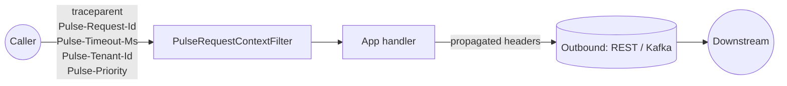

# Concepts

Pulse is built on a small set of ideas that recur across every subsystem.
Read this once and most of the feature pages will explain themselves.

## Three places context lives

Every request that flows through a Pulse-instrumented service carries
correlation data in **three** stores. Pulse keeps them in sync — you never
have to copy values between them by hand.

| Store | Survives across | Used by |
|---|---|---|
| **MDC** (`org.slf4j.MDC`) | The current thread | Log appenders (every JSON log line is auto-stamped) |
| **OTel Baggage** | Process boundary (via the configured `TextMapPropagator`) and threads (via `io.opentelemetry.context.Context`) | OTel-aware libraries; downstream services |
| **Pulse outbound headers** | HTTP / Kafka calls Pulse instruments | `RestTemplate`, `RestClient`, `WebClient`, `OkHttp`, Kafka producers |

When a Pulse filter resolves something — a trace ID, a request ID, a tenant,
a priority, a remaining timeout — it writes it to **all three**. When an
outbound HTTP client makes a call, all three stores are read so the
downstream service inherits the same view.

## Inbound and outbound, symmetrically

- The **`PulseRequestContextFilter`** runs once per request. It extracts trace,
  request ID, tenant, priority, and timeout-budget from incoming headers (with
  sensible defaults when missing), seeds MDC + baggage, and ensures everything
  is cleared in a `finally` block so threads don't leak state.
- The **outbound interceptors** (one per supported client) read the same
  three stores and stamp the matching headers on every call. The Kafka
  variants do the same on `ProducerRecord` headers and the consumer-side
  `RecordInterceptor`.

The result: you don't think about propagation. You think about your handler.

## Three signal types, one consistent shape

| Signal | Where it goes | Pulse contribution |
|---|---|---|
| **Metrics** | Micrometer → Prometheus / OTLP | Cardinality firewall; common tags; meter naming convention |
| **Traces** | OpenTelemetry SDK → OTLP | Sampling guardrails; baggage propagation; auto span events |
| **Logs** | Log4j2 / Logback → stdout (JSON) | OTel semconv field set; PII masking; resource attributes |

A single user action looks like the **same** correlation fingerprint across
all three signals: same `traceId`, same `requestId`, same `userId`, same
`deployment.environment`, same `service.name`. You can pivot from a Loki log
line to a Jaeger trace to a Prometheus metric without ever copying an ID by
hand.

## Defaults that survive a 3 AM on-call

Every subsystem ships **on** with a default that is conservative for
production:

- Cardinality firewall: 1000 distinct values per `(meter, tag)` before
  bucketing into `OVERFLOW`.
- Timeout-budget: 2-second default budget, 30-second edge clamp,
  50 ms safety margin before outbound calls.
- PII masking: emails, SSNs, credit cards, Bearer tokens, and JSON
  `password|secret|token|apikey` fields, redacted by default.
- Sampling: 100% in dev, configurable in prod
  (`pulse.sampling.probability`).
- Trace-context guard, structured logs, exception fingerprints, async
  context propagation: all on.

Every subsystem can be turned **off** with `pulse.<subsystem>.enabled=false`.
You pay for what you turn on.

## Naming conventions

Pulse follows two rules consistently across the codebase, so you can guess
both metric and config names:

- **Metric names**: `pulse.<subsystem>.<measure>` with `snake_case` *within*
  each dot-segment. Example: `pulse.timeout_budget.exhausted`,
  `pulse.kafka.consumer.time_lag`. Prometheus normalises these to
  `pulse_timeout_budget_exhausted_total`,
  `pulse_kafka_consumer_time_lag_seconds`, etc.
- **Configuration keys**: `pulse.<subsystem>.<knob>` with `kebab-case`
  *within* each dot-segment (Spring's relaxed binding handles both forms).
  Example: `pulse.timeout-budget.default-budget`,
  `pulse.cardinality.max-tag-values-per-meter`.

## Diagnostics, always

When something looks off, the answer is **never** "redeploy with debug
logging." Pulse exposes:

- **`/actuator/pulse`** — JSON snapshot of every subsystem and its effective
  configuration.
- **`/actuator/pulseui`** — single-page HTML rendering of the same.
- **`/actuator/pulse/runtime`** — top cardinality offenders, SLO compliance,
  exporter freshness.
- **`/actuator/pulse/effective-config`** — full resolved `PulseProperties`
  tree.
- **`/actuator/pulse/slo`** — generated `PrometheusRule` YAML, ready for
  `kubectl apply`.

The bar is: if Pulse changed something about your request, you can ask the
actuator what and why.
