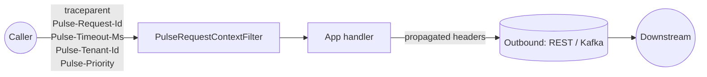

# Concepts

A small set of ideas explains how Pulse works under the covers. Read this
once and most of the feature pages will explain themselves.

## Three places context lives

Every request flowing through a Pulse-enabled service carries correlation
data in three stores. Pulse keeps them in sync — you never have to copy
values between them by hand.

| Store | Survives across | Used by |
| --- | --- | --- |
| **MDC** (`org.slf4j.MDC`) | The current thread | Log appenders — every JSON log line is auto-stamped |
| **OTel Baggage** | Process boundaries (via the configured propagator) and threads (via OTel `Context`) | OTel-aware libraries; downstream services |
| **Pulse outbound headers** | HTTP and Kafka calls Pulse instruments | `RestTemplate`, `RestClient`, `WebClient`, `OkHttp`, Kafka producers |

When Pulse resolves something — a trace ID, a request ID, a tenant, a
priority, a remaining timeout — it writes to **all three**. When an outbound
HTTP client makes a call, all three are read so the downstream service
inherits the same view.

## Inbound and outbound, symmetrically

The **request filter** runs once per request. It reads trace, request ID,
tenant, priority, and timeout-budget from the incoming headers (with sensible
defaults when they're missing), seeds MDC and baggage, and clears them in a
`finally` so threads don't leak state.

The **outbound interceptors** — one per supported HTTP / Kafka client — read
those same three stores and stamp the matching headers on every call. The
Kafka variants do the same on `ProducerRecord` headers and consumer-side
record interceptors.

The result: you don't think about propagation. You think about your handler.

## Three signals, one consistent shape

| Signal | Where it goes | Pulse's contribution |
| --- | --- | --- |
| **Metrics** | Micrometer → Prometheus / OTLP | [Cardinality firewall](features/cardinality-firewall.md), common tags, naming convention |
| **Traces** | OpenTelemetry SDK → OTLP | [Sampling guardrails](features/sampling.md), baggage propagation, automatic span events |
| **Logs** | Log4j2 / Logback → stdout (JSON) | [OTel-aligned field set](features/structured-logs.md), PII masking, resource attributes |

A single user action carries the **same correlation fingerprint** across all
three: same `traceId`, same `requestId`, same `userId`, same
`deployment.environment`, same `service.name`. You can pivot from a Loki log
line to a Jaeger trace to a Prometheus metric without ever copying an ID by
hand.

## Defaults that survive a 3 AM on-call

Every feature ships **on** with conservative production defaults:

- Cardinality firewall: 1000 distinct values per `(meter, tag)` before the
  rest get bucketed.
- Timeout-budget: 2-second default, 30-second upper limit, 50 ms safety
  margin before outbound calls.
- PII masking: emails, SSNs, credit cards, Bearer tokens, and JSON
  `password / secret / token / apikey` fields, redacted by default.
- Sampling: 100% in dev, configurable for prod via Spring Boot's standard
  `management.tracing.sampling.probability` (Pulse defers to it). Pulse adds
  `pulse.sampling.prefer-sampling-on-error` on top to guarantee error spans
  are recorded regardless of the head rate.
- Trace-context guard, structured logs, exception fingerprints, async
  context propagation: all on.

Every feature can be turned **off** with `pulse.<feature>.enabled=false`.
You pay for what you turn on.

## Naming conventions

Pulse uses two rules consistently across the codebase, so once you've seen
one metric or config key you can guess the rest:

- **Metric names**: `pulse.<feature>.<measure>` with `snake_case` *within*
  each segment. Example: `pulse.timeout_budget.exhausted`,
  `pulse.kafka.consumer.time_lag`. Prometheus normalises these to
  `pulse_timeout_budget_exhausted_total`,
  `pulse_kafka_consumer_time_lag_seconds`.
- **Configuration keys**: `pulse.<feature>.<knob>` with `kebab-case` within
  each segment (Spring's relaxed binding accepts both). Example:
  `pulse.timeout-budget.default-budget`,
  `pulse.cardinality.max-tag-values-per-meter`.

## Diagnostics, always

When something looks off, the answer is **never** "redeploy with debug
logging." Pulse exposes:

| Endpoint | What it shows |
| --- | --- |
| `/actuator/pulse` | JSON snapshot of every feature and its effective configuration |
| `/actuator/pulseui` | Single-page HTML rendering of the same |
| `/actuator/pulse/runtime` | Top cardinality offenders, SLO compliance, exporter freshness |
| `/actuator/pulse/effective-config` | Full resolved `pulse.*` configuration tree |
| `/actuator/pulse/config-hash` | Fleet-drift hash + contributing keys |
| `/actuator/pulse/enforcement` | Current [enforcement mode](features/enforcement-mode.md); `POST` flips it at runtime |
| `/actuator/pulse/slo` | Generated `PrometheusRule` YAML, ready for `kubectl apply` |

The bar is: if Pulse changed something about your request, you can ask the
actuator what and why.

## Stability promise

Pulse 2.x draws a hard line between the **public surface** you're meant to
depend on (config keys, metric names, SPI interfaces, types in non-`internal`
packages, actuator endpoint shapes) and the **wiring** that makes it work
(everything under `.internal` packages, auto-configuration class names,
most `@Bean` names). See [API stability](api-stability.md) for the full
contract, the deprecation policy, and the Java / Spring Boot version
policy.
