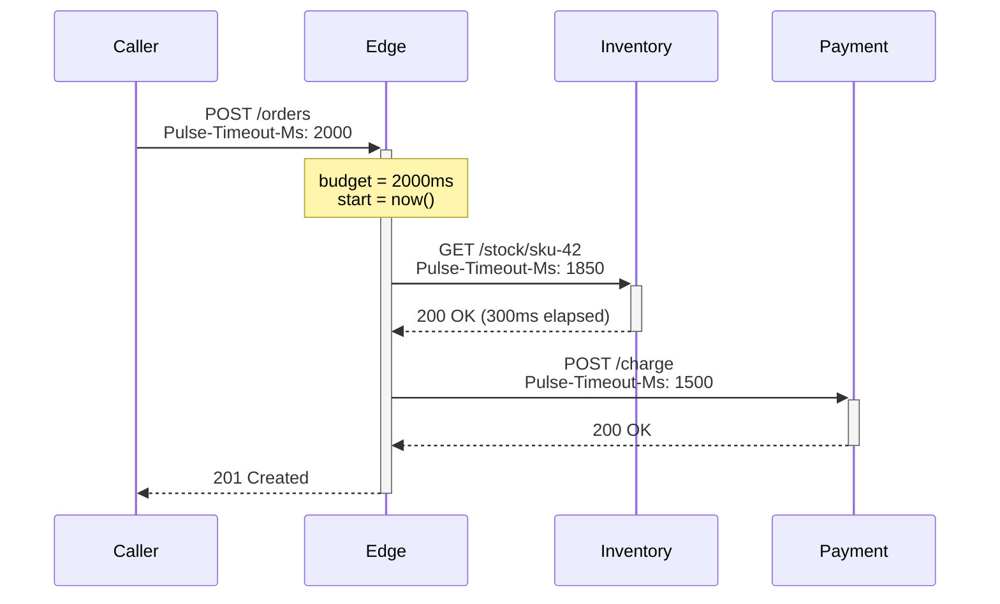

# Timeout-budget propagation

> **Status:** Stable · **Config prefix:** `pulse.timeout-budget` ·
> **Source:** [`TimeoutBudget.java`](https://github.com/arun0009/pulse/blob/main/src/main/java/io/github/arun0009/pulse/guardrails/TimeoutBudget.java),
> [`TimeoutBudgetFilter.java`](https://github.com/arun0009/pulse/blob/main/src/main/java/io/github/arun0009/pulse/guardrails/TimeoutBudgetFilter.java),
> [`TimeoutBudgetOutboundInterceptor.java`](https://github.com/arun0009/pulse/blob/main/src/main/java/io/github/arun0009/pulse/guardrails/TimeoutBudgetOutboundInterceptor.java) ·
> **Runbook:** [Timeout-budget exhausted](../runbooks/timeout-budget-exhausted.md)

## Value prop

In a 10-service request chain, the platform default timeout (typically
30 seconds, set once and forgotten) is what every downstream uses. The
caller may have already given up after 2 seconds — the chain doesn't know,
holds connections open, and contributes to retry storms.

Pulse propagates the **deadline**, not the timeout. The downstream sees the
real remaining budget and fails fast instead of holding a connection open
for 28 more seconds.

## What it does

Pulse runs three pieces:

1. **`TimeoutBudgetFilter`** parses the configured inbound header (default
   `Pulse-Timeout-Ms`) on every request, clamps it to
   `pulse.timeout-budget.maximum-budget` for edge safety, places the absolute
   deadline on OTel baggage and a thread-local accessor, and clears them in
   `finally`.
2. **`TimeoutBudgetOutboundInterceptor`** is wired into every Pulse-supported
   client (`RestTemplate`, `RestClient`, `WebClient`, `OkHttp`, Kafka
   producer). On every outbound call it computes the *remaining* budget
   minus `safety-margin` and writes the configured outbound header.
3. When the remaining budget is below `pulse.timeout-budget.minimum-budget`
   *before* the call fires, Pulse aborts the call, increments
   `pulse.timeout_budget.exhausted{transport}`, and emits a `WARN` log so
   retry-storm precursors are visible *before* they become incidents.



If anywhere in the chain a service spends 1900 ms on its own work, the next
outbound call sees ~50 ms remaining (already ≤ `safety-margin`), aborts, and
increments `pulse.timeout_budget.exhausted` *before* slamming the
downstream with a doomed request.

## Reading the budget from your code

```java
// In a controller, service, or any code on the request thread:
TimeoutBudget.current().ifPresent(budget -> {
    Duration remaining = budget.remaining();
    if (remaining.compareTo(Duration.ofMillis(500)) < 0) {
        // skip the optional enrichment call — not enough time
    }
});
```

`TimeoutBudget.current()` returns an `Optional<TimeoutBudget>` — empty
means the request didn't carry a budget header (or the budget filter is
disabled), full means you can read `remaining()` for the wall-clock time
left.

## Metrics emitted

| Metric | Type | Tags | Description |
|---|---|---|---|
| `pulse.timeout_budget.exhausted` | Counter | `transport` (`rest-template`, `rest-client`, `web-client`, `ok-http`, `kafka-producer`) | Outbound calls aborted because the remaining budget was below `minimum-budget` |

Prometheus normalises this to `pulse_timeout_budget_exhausted_total`.

## Headers / baggage / MDC

| Store | Key | Value |
|---|---|---|
| HTTP header (in / out) | `Pulse-Timeout-Ms` (configurable) | Absolute milliseconds remaining |
| OTel baggage | `pulse.timeout.deadline_ms` | Epoch-millis deadline |
| MDC | `timeout_remaining_ms` | Current-thread remaining (for logs) |

The header name follows RFC 6648 (no `X-` prefix). `inboundHeader` and
`outboundHeader` can be configured separately if you need to bridge to a
legacy convention.

## Configuration

```yaml
pulse:
  timeout-budget:
    enabled: true                        # default
    inbound-header: Pulse-Timeout-Ms     # default
    outbound-header: Pulse-Timeout-Ms    # default
    default-budget: 2s                   # used when no inbound header is present
    maximum-budget: 30s                  # edge clamp — caller cannot demand more
    safety-margin: 50ms                  # subtracted from outbound budget
    minimum-budget: 100ms                # below this, outbound calls abort
```

| Key | Type | Default | Notes |
|---|---|---|---|
| `enabled` | boolean | `true` | Master switch |
| `inbound-header` | string | `Pulse-Timeout-Ms` | Where Pulse reads the budget from |
| `outbound-header` | string | `Pulse-Timeout-Ms` | Where Pulse writes the budget on outbound calls |
| `default-budget` | Duration | `2s` | Applied when no inbound header is present |
| `maximum-budget` | Duration | `30s` | Hard upper bound — caller cannot demand more |
| `safety-margin` | Duration | `50ms` | Subtracted from the outbound budget so the downstream still has time to fail cleanly |
| `minimum-budget` | Duration | `100ms` | Outbound calls with less remaining than this are aborted |

## Shipped alert

`PulseTimeoutBudgetExhausted` fires when
`rate(pulse_timeout_budget_exhausted_total[5m]) > 0` for more than 2 minutes.
Combined with the [retry-amplification metric](retry-amplification.md), these
two signals are the leading indicators of a cascading failure.

## When to turn it off

Disable when your platform already enforces a request budget end-to-end
(Envoy timeouts, Istio request timeouts, gRPC deadlines you trust) and you
don't want Pulse maintaining a parallel mechanism:

```yaml
pulse:
  timeout-budget:
    enabled: false
```

The header *parsing* and *aborting* both stop; everything else (sampling,
trace context, MDC) keeps working.

## Edge ingress note

If you run an API gateway or Spring Cloud Gateway in front of services,
configure it to set `Pulse-Timeout-Ms` based on the gateway's own request
timeout. Otherwise the first hop will use `default-budget`, and the second
hop onward gets propagated values — surprising but correct.
